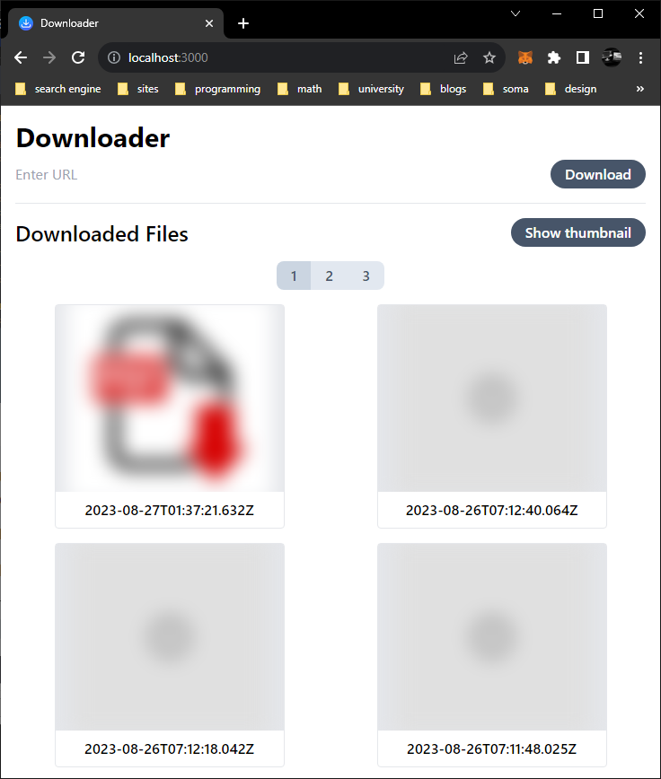

# File Downloader

## Description

This is a simple file downloader that can download files from the internet. It can download files from a URL.

- Default download location is `download/` under the current directory.
- Thumbnails will be generated for images and videos.
- Using docker image is recommended.
  - Run `docker build -t file-downloader .` to build the image.
  - Run `docker run -v $(pwd)/download:/app/download -p 3000:80 file-downloader` to run the image.
